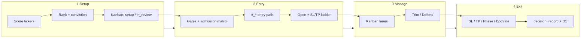
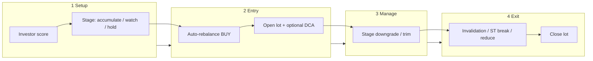

# Engine Flow — One Pager

How Timed Trading moves from **signal → setup → entry → manage → exit** on
both engines. For the interactive admin view see **System Intelligence → How It Works**.

---

## Active Trader (`engine: trader`)

**Cadence:** 5-minute scoring cron · **Entry engine:** `tt_core` (default) ·
**Management:** `tt_core` exit pipeline + inline kanban

### 1 — Setup (what the engine watches)

Every 5 minutes the worker scores the universe and builds a payload per ticker.

| Signal | What it means | Module |
|--------|---------------|--------|
| **Rank** (0–100) | Composite edge score; gates min rank for entry | `computeRank()` |
| **Focus conviction** | TA quality tier A/B/C | `computeConvictionScoreForD()` |
| **Regime** | HTF/LTF state (BULL/BEAR/PULLBACK) | `regime-markov`, HMM |
| **Phase %** | Saty cycle position | `indicators.js` |
| **Squeeze release** | 30m/1h squeeze → expansion | flags on payload |
| **EMA / Ripster clouds** | Structure, pullback depth | `indicators.js` |
| **Setup grade** | Prime / Confirmed / Speculative (at entry) | stamped on trade |

**Kanban:** no position → `setup` (pattern building) → `in_review` when
`qualifiesForEnter()` passes.

### 2 — Entry (how a trade opens)

Priority stack picks one **entry path** (`tt_*` play):

| Priority | Path | Trigger idea |
|----------|------|--------------|
| 1 | `tt_gap_reversal_long/short` | Gap + reversal structure |
| 2 | `tt_n_test_support/resistance` | Horizontal level bounce |
| 3 | `tt_range_reversal_long/short` | Range edge fade |
| 4 | `tt_ath_breakout` / `tt_atl_breakdown` | New high / low break |
| 5 | `tt_momentum` | Trend continuation |
| 6 | `tt_pullback` | Reclaim / bounce into trend |
| 7 | `tt_reclaim` | ST flip + reclaim |
| 8 | `tt_mean_revert` | PDZ exhaustion + TD9 |

**Gate stack (in order):** universal gates → rank/conviction floors →
**admission matrix** (regime × path × grade) → calibration guards →
AI CIO (optional) → size + **SL/TP tiers** (trim 33% / exit 67% / runner).

Key reject reasons: `tt_pullback_not_deep_enough`, `setup_admission_regime_blocked`,
`focus_conviction_below_floor`, `deep_audit_*` calibration blocks.

### 3 — Manage (open position)

Each tick classifies the open trade into kanban lanes:

| Lane | Meaning | Typical triggers |
|------|---------|------------------|
| **just_entered** | Fresh fill | First N minutes |
| **defend** | Hold but stress | Adverse move, bias flip, bleeder shield |
| **trim** | Take partial profit | RSI extreme, PDZ, phase fuel, Ripster trim |
| **exit** | Close imminent | SL breach, doctrine force, max loss |

**Management modules:** `tt-core-exit.js`, exit doctrine, trend-hold suppression,
MFE ratchet, phase-leave, bleeder guard (flag OFF by default).

### 4 — Exit (how a trade closes)

| Class | Examples |
|-------|----------|
| Hard stop | `sl_breached`, max-loss fuse |
| Profit take | `TP_FULL`, RSI fuse, MFE trail |
| Structural | 4H ST flip, cloud break |
| Phase | `PHASE_LEAVE_100`, phase-I fast-cut |
| Event | `PRE_EVENT_RECOVERY_EXIT` |

Every EXIT/TRIM/DEFEND can write a **`decision_record`** with `config_hash`
and `engine_git_sha` for attribution.

---

## Investor (`engine: investor`)

**Cadence:** hourly score + daily replay · **Capital:** auto-rebalance lots ·
**No tt_* entry paths**

### 1 — Setup

| Signal | Use |
|--------|-----|
| **Investor score** | Weekly/monthly structure, RS vs SPY |
| **Accumulation zone** | Mean-reversion or momentum-runner dip |
| **Market health** | Skip new init if health < 25 |
| **Timing overlay** | Blocks accumulate at TOP unless compounder dip |
| **Stage** | `accumulate`, `watch`, `core_hold`, `reduce`, `exited`, `avoid` |

Computed via `POST /timed/investor/compute` → KV `timed:investor:scores`.

### 2 — Entry (initiation)

`POST /timed/investor/auto-rebalance`:

- Opens/adds when stage is **accumulate** or **watch** (starter size)
- Caps: 20 positions, 3 new names/day, 8% max allocation
- Sizing: 5% base accumulate, 7% strong, 2% watch starter
- Optional DCA schedule on new accumulate names

### 3 — Manage

| Mechanism | Behavior |
|-----------|----------|
| Stage downgrade | Score/RS/ST → `watch` or `reduce` |
| Structural reduce | Monthly/weekly ST bearish — no CIO deferral |
| Reduce trim | 30% trim after 2-session confirm |
| DCA tranches | Monthly 2% capital with RVOL gates |
| Exhaustion | ≥2 warnings → stop adds |

### 4 — Exit

| Reason | Trigger |
|--------|---------|
| `primary_invalidation_breach` | Price vs sticky invalidation floor |
| `monthly_supertrend_bearish` | Monthly ST flip |
| `weekly_supertrend_bearish` | Weekly ST flip |
| `investor_score_very_low` | Score < 30 |
| `choppy_regime_losing` | CHOPPY + PnL < −8% |

Daily evaluator: `runInvestorDailyReplay()` (regime exit, trailing stop,
2-day reduce confirm — not covered by auto-rebalance alone).

---

## Shared principles

1. **Rank + conviction** gate Active Trader entries; **investor score + stage**
   gate Investor capital.
2. **Admission matrix** blocks known-toxic (path × regime × grade) combos on
   Active Trader only.
3. **Provenance:** `decision_records` pin every material action to config epoch.
4. **Flags OFF until validated:** conviction fusion sizing, bleeder shield.

---

## Where to go deeper

| Topic | Doc / code |
|-------|------------|
| July backtest readiness | `docs/july-readiness-review-2026-06.md` |
| Signal catalog | `docs/signal-family-catalog-v1.md` |
| Self-calibrating loop | `docs/self-calibrating-loop.md` |
| Admission matrix | `worker/phase-c-setup-admission.js` |
| Entry paths | `worker/pipeline/tt-core-entry.js` |
| Exit pipeline | `worker/pipeline/tt-core-exit.js` |
| Investor | `worker/investor.js` |
| Live admin flow diagram | System Intelligence → **How It Works** tab |
