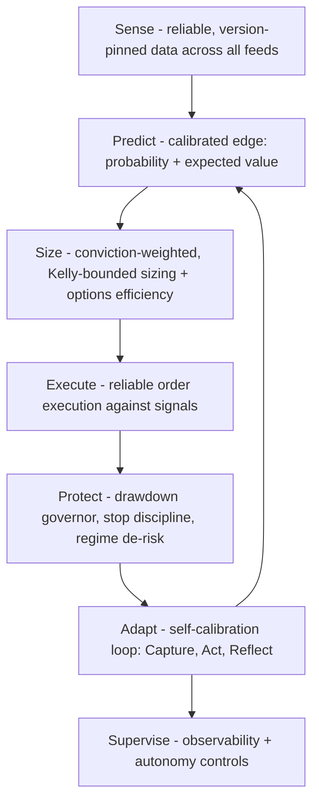
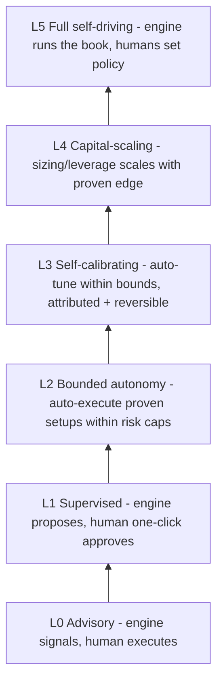

# North Star: A Self-Driving Engine That Compounds Edge

**The destination.** A fully autonomous, self-calibrating engine that senses the market from reliable data, produces *edge-bearing* signals, sizes and executes trades with conviction, protects capital ruthlessly, and continuously re-tunes itself as conditions change — **supervised by humans, not operated by them** — compounding returns toward **5-10x the S&P YoY**.

**The honest math.** 5-10x the S&P is roughly **100-200% net annually, sustained** — Medallion-tier, which almost no one holds for long. It is not reachable by reliability alone. It is the product of stacked multipliers, and we must architect for all of them:

- **Edge** - calibrated probability x payoff per bet (measured expectancy, not vibes).
- **Breadth** - many *independent*, high-EV bets compounding (frequency x diversification).
- **Sizing** - conviction-weighted, Kelly-bounded sizing that presses what's proven.
- **Capital efficiency** - defined-risk **options** on high-conviction runners. (MU is the proof: a 21-EMA-bounce runner as calls compounds far faster than shares, with capped downside.)
- **Survival** - ruthless loss-cutting (the SL hard-close, shipped) + a drawdown governor, because geometric compounding punishes variance.
- **Adaptation** - the self-calibration loop that keeps the edge alive as it decays.

Reliability is the floor. **Edge x efficiency x compounding x survival** is the engine. We architect toward the target, measure honestly against it, and never fake it.

---

## Living status (updated 2026-07-07)

Canonical implementation log: [`docs/self-calibrating-loop.md`](../docs/self-calibrating-loop.md).

| Todo | Progress | Blocker / next action |
|------|----------|---------------------|
| **foundation-trust-to-automate** | ~45% | Investor TRIM provenance wiring (this PR); feed health contract on `/timed/health`; broker manifest still `log` mode |
| **edge-calibrated-signals** | ~15% | `fuseConviction()` built, flags OFF; rank still ~0 PnL correlation; forward validation on live `decision_records` |
| **sizing-and-capital-efficiency** | ~10% | Kelly in SI/calibration UI only; options plays exist but not primary expression path |
| **closed-self-calibration-loop** | ~30% | `decision_records` + `config_hash` live (62 rows, 6 epochs); rollback exists; automated before/after scorecard not wired |
| **autonomy-ladder-and-governor** | ~5% | L0 advisory today; no formal rung gates |
| **portfolio-and-drawdown-control** | ~20% | `portfolio-risk.js` shadow-first; SL hard-close shipped |
| **followability-rides-on-top** | ~30% | Ledger/CIO routes exist; unified WHY timeline + taxonomy pending |

**Production snapshot (2026-07-07):** 62 `decision_records` (11 trader ENTRY, 18 investor ENTRY, 5 trader TRIM, 0 investor TRIM — gap fixed in this PR). Conviction/bleeder flags remain OFF until forward validation clears.

**Validation commands:**

```bash
node scripts/validate-decision-records-live.mjs --wrangler-d1 production --remote
node scripts/validate-conviction-corpus.mjs
node scripts/check-scoring-version-bump.mjs   # CI guard
```

---

## The capability stack (what a self-driving engine needs)



Today TT has *nascent* versions of every layer (broker bridge + options auto-mirror for Execute, risk-based sizing for Size, calibration + COO for Adapt, scoring for Predict). The work is to **mature each layer into a coherent engine** and connect them with one shared provenance thread.

## How we get there: the autonomy ladder

The path is a ladder, and **you only earn the next rung by proving attributed edge on the current one.** This is the through-line that makes provenance and the closed loop the *foundation*, not cleanup: they are the **license to automate more and risk more capital**.



**Rung gates (advance only when all are true):**
- Attributed positive expectancy over N independent trades, **across regimes** (not one lucky tape).
- Max drawdown stayed within the risk budget.
- Every decision is reproducible and version-pinned (so the edge is real, not a calc artifact).
- Every auto-change is reversible with a measured before/after.

## The path: four movements that climb the ladder

### 1. Foundation - the license to automate (L0 -> L1)
You cannot safely cede control or add capital to a system you can't trust or reproduce.
- **Provenance keystone:** one immutable, version-pinned `decision_record` on every entry/trim/defend/exit - `{ scoring_version, engine_git_sha, config_hash, schema_version }` + scored-input slice + gate trace + reason. Snapshot trims/defends (today only price+reason). CI guard that bumps `SCORING_VERSION` when scoring files change.
- **Sense:** extend the health contract (`/timed/health`) to all feeds (research/catalysts/fundamentals/events) with self-heal + fail-loud flagging; reconcile universe membership with per-ticker data completeness.
- **Execute reliably:** harden the broker bridge + options auto-mirror so signals translate to fills dependably, with slippage tracking.

### 2. Edge - where the alpha actually comes from (L1 -> L2)
Scores don't compound; *expectancy* does.
- **Calibrated signals:** every signal carries a **probability of success and an expected value**, validated out-of-sample. Today rank v1 has ~0 PnL correlation - replace/recalibrate so the number means money.
- **Conviction as one tradable number:** fuse theme + FSD/research + fundamentals + TA into a single conviction that drives both entry *and* hold patience (the MU gap: research must make the engine more patient, not just be telemetry).
- **One coherent runner strategy:** daily EMA21 as a first-class signal, Trend-Hold enabled + ordering fixed, the ~60-rule pile consolidated into one decision tree.

### 3. Magnitude - the 5-10x levers (L2 -> L4)
This is the difference between "beats the S&P" and "5-10x the S&P."
- **Conviction-weighted, Kelly-bounded sizing** that scales position size with proven edge and shrinks it when edge or regime weakens.
- **Options-first expression** for high-conviction runners - defined-risk calls/puts as the primary vehicle for the highest-EV setups, because capital efficiency is the biggest multiplier toward triple-digit returns.
- **Portfolio construction:** maximize *independent* high-EV bets (breadth), cap correlation and sector/directional exposure, so compounding isn't wrecked by clustered losses.

### 4. Self-calibration + survival - compound it and keep it (L3 -> L5)
The loop is the engine of durability; the governor is what protects the compounding.
- **Close the loop with attribution (Capture -> Act -> Reflect):** route every config/calc change through one bus with evidence + rollback + before-value; automated scorecards join each change to rolling SQN/PF/WR - **reliable only because Step-1 stamped the version on every decision.**
- **Champion/challenger:** the engine proposes parameter changes, tests them in shadow against the champion, and promotes only attributed winners - self-improvement with guardrails.
- **Drawdown governor + regime exposure:** automatically cut size/leverage on drawdown or hostile regime; press in trending tape, sit out chop.

## The connective tissue (why this finally compounds)

One shared key - `{ scoring_version, engine_git_sha, config_hash, schema_version }` - written at **Capture**, carried through **Act**, joined at **Reflect**. Without it, every "did this help?" is a guess and the engine can't safely self-tune or scale capital. With it, the loop becomes a flywheel: prove edge -> earn autonomy -> add capital -> compound -> re-tune as it decays. That flywheel is the only credible route to a sustained 5-10x.

## Rides on top: followability (supervision for humans + users)

The supervising human and the end user both need to see what the engine is doing and why: one enforced notification taxonomy, a user-facing "why did TT do this?" feed (extend the Right Rail `/timed/ledger/trades/:id/cio` pattern), a single prioritized "Today's Plays" queue, and fixing Insights' identity drift + its false "AI CIO Decisions" promise. As autonomy rises, this becomes the **mission-control cockpit**: health + WHY + posture + current autonomy level on one screen.

## Where we are vs the gap to north star

- **Predict:** scores exist, but not calibrated probability/EV -> can't size by edge. **(biggest alpha gap)**
- **Size:** risk-based sizing exists, but not conviction/Kelly-scaled or options-first. **(biggest magnitude gap)**
- **Execute:** bridge + options auto-mirror exist, but trust/governor gates don't.
- **Adapt:** calibration + COO exist, but the loop is open and unattributed. **(biggest durability gap)**
- **Sense / Protect / Supervise:** strong for prices/candles + SL discipline; partial elsewhere.

## Recommended sequence

Foundation first (it's the license to climb): provenance keystone + all-feed data health + execution hardening. In parallel, begin the **Edge** work (calibrated probability/EV) because that's where alpha is born. Then **Magnitude** (sizing + options-first + portfolio) and the **closed self-calibration loop** unlock L3->L4, where 5-10x becomes physically possible. The autonomy governor and drawdown control gate every capital increase. Quick wins (SL hard-close done, notification labeling) run alongside.

## Open strategic decisions (these shape the whole build)

1. **Route to magnitude:** lean primarily on **options-first capital efficiency** on concentrated high-conviction runners, on **breadth** (many independent small-edge bets), or an explicit blend? This sets the sizing + portfolio architecture.
2. **Risk appetite / drawdown budget:** what max peak-to-trough drawdown is acceptable in pursuit of 100-200%? The governor and Kelly fraction are calibrated to this single number.
3. **Autonomy posture:** how fast do you want to climb L0->L5, and what capital-at-risk cap per rung? (Faster climb = more upside sooner, more operational risk.)
4. **First slice:** I recommend a thin end-to-end proof - one high-conviction setup family, captured with full provenance, expressed as a Kelly-sized options position, executed via the bridge, and attributed in the loop - to validate the entire spine on one trade type before going wide. Agree, or start with the Edge/calibration layer?
