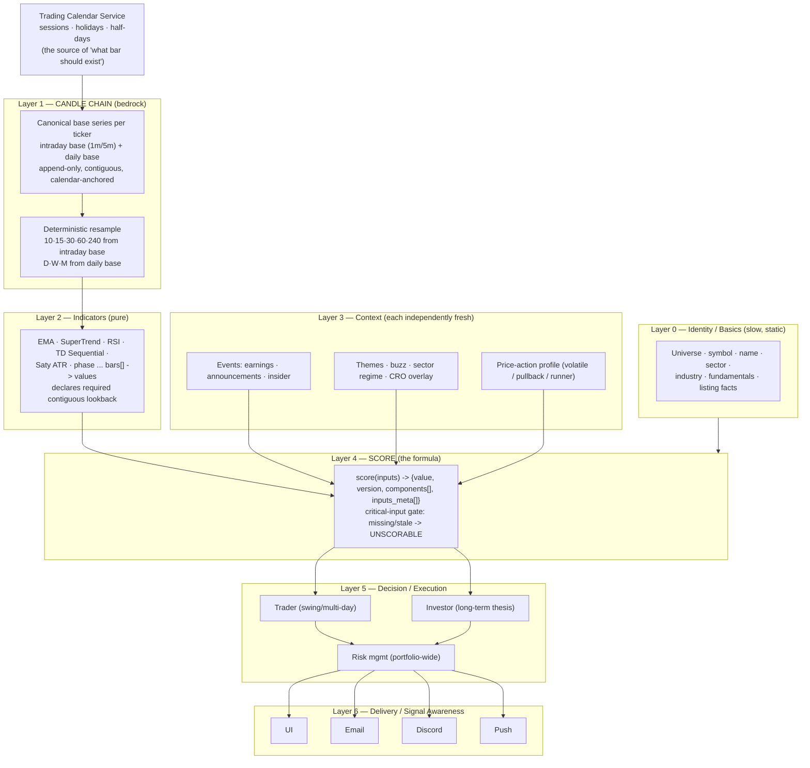

# 2026-06-14 — Foundation Rebuild Plan ("build it like a startup, with intention")

Operator ask (2026-06-14): backtests showed strong results in a controlled
environment where candles were always backfilled first; live never matched,
because live freshness was patched with guards rather than designed in. The
mandate: design a foundation where the **candle chain is clean and
fail-proof by construction**, then a **scoring formula that is deterministic
(inputs → outputs)** on top of it — and build it as composable services, not
a monolith.

This is a design contract + migration plan, NOT an incremental patch. It is
written greenfield ("if we were a brand-new startup building Timed Trading")
and then mapped to a strangler-fig migration so we never throw away the
10 months of proof or the doctrine that already works.

---

## 0. Why live ≠ backtest (the root cause, stated precisely)

- Backtest: every run **backfilled candles first**, so the indicator inputs
  were complete and contiguous. Indicators were correct → scores were correct.
- Live: candles for some timeframes drifted stale mid-session (each TF is an
  independent series — see §2), so indicators silently computed on short or
  gappy windows. **The score still emitted a number.** It looked fresh, ranked,
  and traded. Different inputs → different outputs → live underperformed the
  backtest it was supposedly identical to.
- We added freshness *guards* after the fact. Guards reduce the blast radius
  but the system is still "on borrowed time until the next silent bug,"
  because correctness depends on a guard catching a defect rather than the
  defect being structurally impossible.

**The fix is structural, in two parts:**
1. A candle chain where staleness/gaps are impossible in the normal path
   (guards become outage alarms, not routine correctness machinery).
2. A score that is a pure function which **refuses to emit a number when a
   critical input is missing or stale** — so a broken lower layer can never
   masquerade as a healthy score.

---

## 1. First principles (the whole plan in five rules)

1. **Layered chain with hard contracts.** Each layer consumes ONLY the
   verified output of the layer below. If a lower layer can't satisfy its
   contract, the upper layer **refuses or degrades explicitly** — it never
   guesses. Errors propagate up as typed "unavailable", never as plausible
   numbers.
2. **Freshness by construction, not by guard.** The candle chain is built so
   that "what bar should exist right now" is *computable* from the trading
   calendar, and the chain keeps itself contiguous as part of ingestion.
   Guards exist only for true provider outages and are expected to fire ~never.
   A guard firing is a SIGNAL (provider down), not business-as-usual.
3. **Determinism + parity.** Live and backtest run the **identical core code**
   over the **identical input contract**. The only injected difference is the
   clock (`asOf`) and which reader (live vs as-of) backs the same interface.
   This makes "backtest ≠ live" structurally impossible.
4. **Score is a formula: inputs → outputs.** Pure, versioned, replay-identical.
   Every component declares its inputs; every input carries `{value, as_of,
   age, available}`. A fixed "critical input" set gates emission.
5. **Composable services, one responsibility each.** Not a 92k-line worker.
   Each layer is independently testable, deployable, and observable.

What we explicitly KEEP from today (hard-won, do not regress): single-writer
price source of truth, replayable ledger, an audit row on every mutation,
the isolated pre-prod env, and config-as-data hot-reload.

---

## 2. The chain (target layered architecture)



Mapping to the operator's three core pieces:
- **Ticker Data** = L0 (Basics) + L1/L2/L3 (Context) + L4 (Score). The plan's
  insistence "1c depends on 1b being fresh" becomes a hard contract: L4 cannot
  emit a number unless L1→L3 satisfied their contracts.
- **Trade Execution** = L5 (Trader, Investor, Risk) — consumes only SCORABLE
  payloads.
- **Reliability** = the cross-cutting property of the contracts, not a bolt-on.

---

## 3. Layer 1 — the Candle Chain (the make-or-break)

This is where the rebuild earns its keep. Design goals: **gap-free,
self-evidencing, single-writer, calendar-anchored, and N→2 freshness points.**

### 3.1 One base series, everything else derived
- Maintain exactly **two canonical series per ticker**: an **intraday base**
  (1m or 5m — pick the finest the provider reliably serves) and a **daily base**.
- DERIVE every working timeframe by deterministic resample:
  - `10/15/30/60/240` ← intraday base
  - `D/W/M` ← daily base (or daily ← intraday close for same-day)
- Consequence: a 30m bar is *always* exactly the aggregate of its constituent
  base bars. Timeframes **cannot drift independently** — the failure mode that
  caused the live divergence (10/15/30 stale while D/60 fresh) becomes
  impossible. We go from 8 independent freshness points per ticker to 2.
- (Today: each TF is fetched/stored separately via `tfConfigs` +
  `d1GetCandlesAllTfs` — the structural defect we are removing.)

### 3.2 Contiguity is an invariant, checked at write time
- The chain stores an append-only, idempotent series keyed by
  `(ticker, base_tf, bucket_ts)`. Writes are upserts (provider revisions allowed
  via a `revision`/`finalized` flag); duplicates are no-ops.
- Every write validates **contiguity against the trading calendar**: the new
  bar's `bucket_ts` must be the immediate successor of `last_finalized_ts`
  given the session schedule. A would-be gap triggers an **inline range
  backfill of exactly the missing buckets before the write commits** — gap
  repair is part of ingestion, not a nightly sweep.

### 3.3 Ingestion is scheduled off the CALENDAR, not off ticks
- A deterministic scheduler knows, for every ticker, the exact next bar that
  *should* exist (calendar + last cursor). It fetches that bar. "Missing" is
  therefore **computed**, never inferred from "did a cron happen to run."
- This is the inversion of today's model (we react to staleness). Here the
  chain is always trying to advance its cursor to the calendar's "now"; falling
  behind is the exception that raises an alarm, not the norm we patch.

### 3.4 Single-writer, per-ticker isolation
- Each ticker's chain is owned by **one writer** (a Durable Object per ticker
  is the natural Cloudflare primitive — also the documented scale path in
  `SYSTEM_OVERVIEW.md` §7). Benefits: no cross-ticker contention, a guaranteed
  single-writer invariant (no torn/duplicate series), and the DO can
  self-verify continuity on every advance.

### 3.5 Provenance + finalization on every bar
- Each bar carries `{source, fetched_at, finalized}`. **Forming** (current,
  mutable) vs **finalized** (closed, immutable) bars are distinguished so
  indicators only consume finalized bars for confirmation logic (TD9, EMA
  cross) and may consume the forming bar only where intended (live triggers).

### 3.6 The contract the chain EXPOSES upward (this is the API everything uses)
```
getSeries(ticker, tf, { asOf, lookback }) -> {
  bars: Bar[],                 // contiguous, finalized unless asked otherwise
  complete: boolean,           // true iff coverage满足 the requested window with no gaps
  last_finalized_ts: number,
  coverage: { expected: n, present: n, gaps: [[from,to], ...] },
  as_of: number,               // the clock this view was built at
  source: "live" | "as_of"
}
```
- Indicators and the score **must** check `complete`. If `complete=false` for a
  required window, the consumer returns UNAVAILABLE — it does not compute on a
  short/gappy series.
- The **same interface** is implemented by a live reader and an as-of (replay)
  reader. That single seam is what guarantees backtest/live parity (§5).

---

## 4. Layer 2 & 4 — pure indicators and the score formula

### 4.1 Indicators (Layer 2)
- Pure functions `bars[] -> value`. No I/O, no clock, no global state.
  Identical in live and backtest.
- Each indicator **declares its data requirement** (e.g., EMA200 needs ≥200
  contiguous finalized D bars; TD9 needs the prior N bars). If the chain can't
  satisfy it, the indicator returns `{available:false, reason}` — never a value
  computed on insufficient history. (This is the precise fix for "TD Sequential
  or EMAs calculated without error.")
- Versioned. Golden-fixture tested (known bars → known values).

### 4.2 Score (Layer 4) — inputs → outputs as a real formula
```
score(inputs) -> {
  value: number | null,
  status: "SCORABLE" | "DEGRADED" | "UNSCORABLE",
  version: "score@<semver>",
  components: [{ name, points, inputs: ["ema_d", "rsi_30", ...] }],
  inputs_meta: { ema_d: {available, as_of, age_ms}, ... },
  missing_critical: [...]
}
```
- **Critical-input policy:** a fixed, declared set of inputs are critical
  (e.g., D + 60 indicators always; 30 + 10 during RTH; sector/SPY baseline for
  the relative components). If any critical input is unavailable/stale, the
  score is `UNSCORABLE(reason)` — **not a number**. Downstream cannot rank or
  trade an UNSCORABLE payload. (Directly kills the "ran on `no_sector_data` /
  `spy_baseline_missing`" class.)
- Pure + deterministic + versioned ⇒ replay-identical ⇒ testable as a formula
  with golden fixtures, and diff-able across versions on a fixed corpus.

---

## 5. Parity harness as a first-class product (the anti-divergence guarantee)

- One **execution core** is shared by live and replay. Injected dependencies:
  the clock and the `getSeries` reader (live vs as-of). Nothing else differs.
- **Parity gate (CI):** pick a frozen historical "golden day," run the
  live-path and replay-path over the same as-of chain, assert **identical
  scores and decisions** (byte-identical component breakdowns). Merge is
  blocked on divergence.
- Baseline first: before any rebuild, measure today's live-vs-replay
  divergence on the golden day so we can prove the new foundation closes it.
- Because the score refuses on incomplete input in BOTH paths, the historical
  failure ("backtest backfilled, live didn't, score didn't notice") cannot
  recur: an incomplete live chain yields UNSCORABLE in live exactly as it would
  in replay.

---

## 6. Target topology (services, not a monolith)

| Service | Responsibility | Cloudflare primitive |
|---|---|---|
| **calendar** | sessions/holidays/half-days; "what bar should exist" | shared lib + KV cache |
| **candle-chain** | per-ticker base series, resample, contiguity invariant, self-heal | **Durable Object per ticker** + D1/R2 storage |
| **indicators** | pure bars→values, declared requirements | shared lib (no deploy of its own) |
| **context** | events / themes / regime / profile, each freshness-stamped | worker + KV, per-domain crons |
| **score** | the pure formula + critical-input gate | shared lib, invoked by engine |
| **engine** | Trader + Investor + Risk on SCORABLE payloads only | worker (role-gated) |
| **delivery** | UI, notifier with fan-out | Pages + **Queues** consumer |
| **platform** | hot snapshots, cold history, per-user sim | KV (hot), R2/parquet (cold candles), DO (per-user) |
| **observability** | every layer emits coverage/freshness/version to one pane | health endpoint + watchdog |

Storage note: `ticker_candles` is the largest table (10M rows / 5.5 GB today).
Cold base bars age out to **R2 (parquet)**; the DO keeps the hot working window
(enough for the deepest indicator lookback) in fast storage.

---

## 7. Migration — strangler-fig, lowest layer first (NOT a big-bang rewrite)

We keep the live system earning while we replace the foundation under it. Each
phase ships behind the existing `*_EXTERNAL` / `*_ENABLED` worker-role flag
pattern (see `skills/worker-topology.md`) and is reversible.

- **Phase 0 — Contracts + parity baseline.** Write the `getSeries`, indicator,
  and score contracts as interfaces. Build the parity harness against the
  CURRENT system. Freeze a golden day. **Measure and record today's live-vs-
  replay divergence** as the baseline we must drive to zero. (No behavior
  change.)
- **Phase 1 — Candle Chain service in shadow.** Build base+resample, calendar
  anchoring, contiguity invariant, per-ticker DO. Run it in **shadow** beside
  the current per-TF store; reconcile its derived series against `ticker_candles`
  and prove **zero gaps for K consecutive weeks** using the chain's own coverage
  report (not an external guard).
- **Phase 2 — Cut indicators + score onto the chain.** Indicators read ONLY via
  `getSeries`; the score gains the critical-input gate and starts returning
  UNSCORABLE on incomplete input. Re-run parity. **This is where live should
  begin matching backtest.** Watch the UNSCORABLE rate — it should be ~0 in
  normal operation; any spike is a real provider event, now visible.
- **Phase 3 — Execution on scorable-only.** Trader/Investor/Risk consume only
  SCORABLE payloads. **Unify the two entry paths** (`tt-core-entry.evaluateEntry`
  and `index.qualifiesForEnter`) into one — the duplication that hid the
  dead-knob bug.
- **Phase 4 — Delivery + per-user isolation + monolith retirement.** Notifier
  via Queues; per-user simulation into DOs; retire the corresponding monolith
  cron lanes via the role-flag cutover. The 92k-line `index.js` shrinks to an
  API/fallback shell.

---

## 8. Success criteria (how we know the foundation is sound)

- **Chain integrity:** 0 unplanned gaps over any rolling 30-day window for all
  maintained tickers, measured by the chain's OWN coverage report. Continuity
  is proven, not assumed.
- **Parity:** live-vs-replay score divergence = 0 on the golden day, enforced
  in CI. (Baseline measured in Phase 0; target reached in Phase 2.)
- **No silent degradation:** a stale/missing critical input ALWAYS yields
  UNSCORABLE (asserted in unit tests + tracked in telemetry as a counter).
  There is no code path that emits a numeric score on incomplete input.
- **Guards are alarms, not machinery:** the freshness-guard fire rate trends to
  ~0 in normal operation. A guard firing maps 1:1 to a real provider outage in
  the incident log. (If guards fire routinely, the foundation isn't done.)
- **Determinism:** score and indicators are pure, versioned, and reproduce
  identically on a frozen candle corpus across runs and machines.

---

## 9. Open design decisions (resolve before Phase 1 build)

1. **Base intraday resolution** — 1m (maximally flexible, ~5x storage) vs 5m
   (cheaper; can't derive sub-5m, which we don't trade). Leaning 5m given the
   "hours/days/weeks" horizon, with 1m only if a setup ever needs it.
2. **Provider for the base** — TwelveData primary (current SoT) with Alpaca as
   the contiguity-repair fallback; define the reconciliation rule when they
   disagree on a finalized bar.
3. **DO-per-ticker vs DO-per-shard** — per-ticker is cleanest for single-writer
   + isolation; per-shard (e.g., 20 tickers) reduces DO count/cost. Decide by
   universe size + cost.
4. **Daily base derivation** — derive `D` from the intraday base for same-day
   freshness, or keep a separately-fetched daily base reconciled to the
   intraday close at session end. (Affects how fast `D` becomes correct
   intraday.)
5. **Cold-storage cutover window** — how many bars the DO keeps hot (must
   exceed the deepest indicator lookback, e.g., EMA200 monthly) before aging to
   R2.

---

## 10. What this plan deliberately does NOT do

- It does not discard the live system or the 10-month proof — it replaces the
  foundation underneath via strangler migration.
- It does not add another freshness guard. The entire thesis is that guards are
  a symptom; we are removing the conditions that make them necessary.
- It does not change scoring *logic/weights* — that's a separate, later
  exercise (the conviction re-weighting from the performance review). This plan
  makes the score a trustworthy, deterministic formula first, so that any
  future weight change is measured on solid ground.
