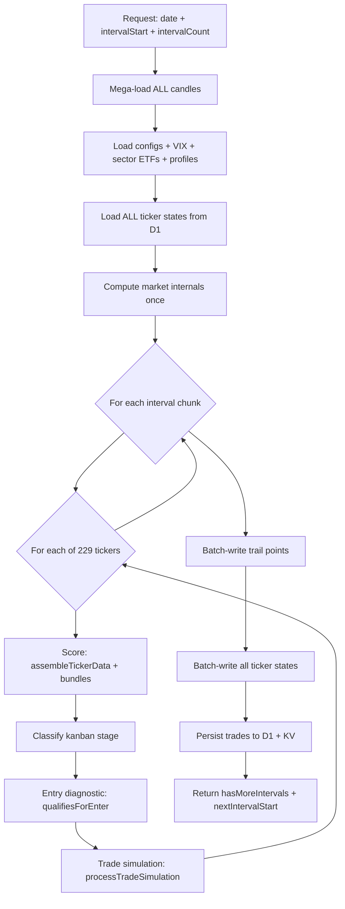

# Interval-First Replay: Architecture

## Problem

The current candle-replay handler processes **10 tickers x 79 intervals = 790 iterations** per request. With the expanded codebase (pipeline imports, context gates, dynamic engine), this exceeds the Cloudflare Worker's CPU/time budget, causing timeouts at ~300s.

The live scoring cron processes **229 tickers x 1 interval** per cycle and works fine. The replay should mirror this pattern.

## Design

New endpoint: `POST /timed/admin/interval-replay`

### Processing Flow (per request)



### Key Innovation: Mega-Batch D1 Queries

Instead of 229 separate `db.batch()` calls (one per ticker), we combine ALL candle queries into **1 db.batch()** call:

- 229 tickers x 7 TFs = **1,603 SELECT statements** in a single `db.batch()`
- D1 paid plan allows up to 5,000 statements per batch
- This uses **1 D1 subrequest** instead of **229**

Similarly, state writes use 3 batched upserts (229 / 100 per batch) instead of 229 individual calls.

### Parameters

| Parameter | Default | Description |
|---|---|---|
| `date` | required | Trading day (YYYY-MM-DD) |
| `intervalStart` | 0 | Starting interval index (0-based) |
| `intervalCount` | 40 | Intervals to process per request |
| `intervalMinutes` | 5 | Replay fidelity |
| `cleanSlate` | 0 | Purge trades on first request |
| `traderOnly` | 0 | Skip investor replay |
| `skipTrail` | 0 | Skip timed_trail writes |
| `tickers` | all SECTOR_MAP | Optional ticker filter |
| `key` | required | Auth key |

### Performance Comparison

| Metric | Old (ticker-batch) | New (interval-first) |
|---|---|---|
| Iterations per request | 790 (10tk x 79int) | ~9,160 (229tk x 40int) |
| D1 subrequests per request | ~80-90 | ~15 |
| CPU time per request | ~25-30s (timeout) | ~15s |
| Requests per day | 23 | 2 |
| Wall time per day | 15-20 min (when working) | ~1-2 min |
| Total backtest (170 days) | 2-5 days (with timeouts) | ~3-4 hours |

The CPU stays low despite more total iterations because:
1. Bundle cache (bundleCache) skips recomputation when candle count unchanged — HTF bundles (M/W/D) compute once, reused across all 40 intervals
2. TD Sequential cache (tdSeqCache) similarly skips
3. Per-ticker overhead (candle loading, config, state I/O) happens ONCE, not 79 times

## Implementation Details

### 1. megaLoadAllCandles (new function)

```javascript
async function megaLoadAllCandles(db, tickers, tfConfigs, beforeTs) {
  const stmts = [];
  const keys = []; // [{ticker, tfKey}]
  for (const ticker of tickers) {
    for (const { tf, limit } of tfConfigs) {
      const tfKey = normalizeTfKey(tf);
      stmts.push(
        db.prepare(
          `SELECT ts, o, h, l, c, v FROM ticker_candles
           WHERE ticker = ?1 AND tf = ?2 AND ts <= ?4
           ORDER BY ts DESC LIMIT ?3`
        ).bind(ticker.toUpperCase(), tfKey, limit, beforeTs)
      );
      keys.push({ ticker, tfKey });
    }
  }
  // D1 batch limit: 5000 statements
  const results = await db.batch(stmts);
  const cache = {};
  for (let i = 0; i < keys.length; i++) {
    const { ticker, tfKey } = keys[i];
    if (!cache[ticker]) cache[ticker] = {};
    const rows = results[i]?.results || [];
    cache[ticker][tfKey] = rows
      .map(r => ({ ts: Number(r.ts), o: Number(r.o), h: Number(r.h),
                    l: Number(r.l), c: Number(r.c), v: r.v != null ? Number(r.v) : null }))
      .filter(x => Number.isFinite(x.ts) && Number.isFinite(x.o))
      .sort((a, b) => a.ts - b.ts);
  }
  return cache;
}
```

### 2. Bulk State I/O (new functions)

**Load all states in 1 query:**
```javascript
const { results } = await db.prepare(
  `SELECT ticker, payload_json FROM ticker_latest`
).all();
const stateMap = {};
for (const r of results) {
  try { stateMap[r.ticker] = JSON.parse(r.payload_json); } catch {}
}
```

**Write all states in 3 batched upserts:**
```javascript
const stmts = allTickers.map(t => {
  const payload = slimPayloadForD1(stateMap[t]);
  return db.prepare(
    `INSERT INTO ticker_latest (ticker, ts, updated_at, kanban_stage, prev_kanban_stage, payload_json)
     VALUES (?1, ?2, ?3, ?4, ?5, ?6)
     ON CONFLICT(ticker) DO UPDATE SET ts=excluded.ts, updated_at=excluded.updated_at,
     kanban_stage=excluded.kanban_stage, prev_kanban_stage=excluded.prev_kanban_stage,
     payload_json=excluded.payload_json`
  ).bind(t, ts, now, stage, prevStage, JSON.stringify(payload));
});
for (let i = 0; i < stmts.length; i += 100) {
  await db.batch(stmts.slice(i, i + 100));
}
```

### 3. Handler Structure

The new handler reuses ALL existing scoring/trading functions from candle-replay (assembleTickerData, qualifiesForEnter, processTradeSimulation, etc.) — it just changes the **iteration order** and **D1 I/O pattern**.

The inner loop becomes:
```javascript
for (let intIdx = intervalStart; intIdx < intervalEnd; intIdx++) {
  const intervalTs = intervals[intIdx];
  for (const ticker of allTickers) {
    // Same scoring + trade simulation as candle-replay
    // Uses same bundleCache, tdSeqCache, stateMap
  }
}
```

### 4. Shell Script Changes

New `--interval-mode` flag changes the inner loop:

```bash
# Old: loop over ticker batches
while true; do
  curl candle-replay?tickerOffset=$OFFSET&tickerBatch=10
  if !hasMore: break
  OFFSET=$NEXT_OFFSET
done

# New: loop over interval chunks
INTERVAL_START=0
while true; do
  curl interval-replay?date=$DAY&intervalStart=$INTERVAL_START&intervalCount=40
  if !hasMoreIntervals: break
  INTERVAL_START=$NEXT_INTERVAL_START
done
```

Response format for the script:
```json
{
  "ok": true,
  "date": "2025-07-01",
  "intervalsProcessed": 40,
  "totalIntervals": 79,
  "tickersProcessed": 229,
  "scored": 9160,
  "tradesCreated": 3,
  "totalTrades": 3,
  "hasMoreIntervals": true,
  "nextIntervalStart": 40,
  "errorsCount": 0,
  "blockReasons": {},
  "stageCounts": {}
}
```

### 5. Edge Cases

- **SPY first**: SPY is moved to index 0 in allTickers so market regime is available for all other tickers at each interval (same as current handler)
- **Cross-chunk state**: stateMap is persisted to D1 at end of each chunk, loaded at start of next. Trades persist via KV (REPLAY_TRADES_KV_KEY)
- **End-of-day**: Last chunk of the day (when `!hasMoreIntervals`) triggers investor replay + portfolio snapshots if not skipped
- **Trail writes**: Batch-write all trail points per chunk. For 40 intervals x 229 tickers = 9,160 points, that's 92 db.batch() calls of 100 statements each (92 subrequests). Total per request: ~15 (loading) + 92 (trail) + 3 (state) = ~110 subrequests. Well under 1,000.

### Files Changed

1. `worker/index.js` — Add route registration + interval-replay handler (~200 lines, mostly adapted from candle-replay with new I/O pattern)
2. `scripts/full-backtest.sh` — Add --interval-mode flag and interval-chunk loop (~30 lines)
3. No changes to scoring functions, trade simulation, indicators, or any other modules
