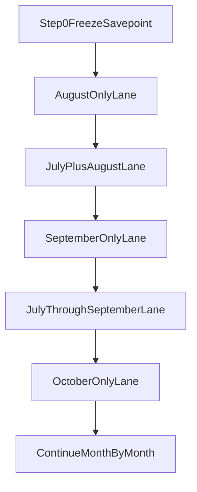

# Month Compounding Operating Model

Date: 2026-04-11

## Purpose

Turn the current recovery effort into a strict compounding workflow:

- start from the latest known-good savepoint
- validate each new month in isolation
- rerun the cumulative window after every accepted refinement
- widen only when the cumulative lane still holds

This document is the operator playbook for the process-first approach.

## Active Parent Savepoint

Every new cycle currently starts from:

- savepoint note:
  `tasks/jul-sep-savepoint-2026-04-11-postdeploy.md`
- parent artifact:
  `data/backtest-artifacts/focused-jul-sep-mainline-deterministic-postdeploy-v1-20260411--20260411-082805`
- parent run:
  `focused_replay_20260411-082805@2026-04-11T15:28:57.408Z`
- parent config:
  `data/backtest-artifacts/july-equalscope-deterministic-parity-v1-config-20260410.json`

Interpretation:

- July is the behavioral anchor.
- September is a preserve-first month.
- August is the active pressure zone.

## Core Rule

Never solve multiple unseen months at once.

Use this order:

1. isolate the next month
2. analyze and refine only against that month plus the preserved anchor behavior
3. rerun the cumulative window
4. widen only if the cumulative lane still holds

## Monthly Expansion Sequence

## Execution Rules

### 1. Parentage must be explicit

Every new run must declare:

- `parent_savepoint_package`
- `parent_savepoint_run_id`
- whether it is:
  - month-isolation
  - cumulative validation
  - diagnostic-only
  - promotion-eligible

### 2. Month isolation comes first

When entering a new month:

- run that month alone first
- identify the loss cluster or behavior drift
- classify each candidate refinement as:
  - baseline behavior
  - regime overlay
  - profile overlay
  - ticker-specific exception

Do not widen before the isolated month has a clear evidence-backed interpretation.

### 3. Cumulative rerun is mandatory

After any accepted refinement for the target month:

- rerun the cumulative window from the original anchor through the current month
- compare against the parent savepoint and the prior cumulative lane
- confirm:
  - the targeted problem improved
  - July remains intact
  - preserved months do not meaningfully regress

### 4. Advancement requires both local and cumulative pass

A month is considered stable enough to advance only when:

- the isolated month is improved or acceptably characterized
- the cumulative rerun still preserves the key strengths of the parent savepoint

### 5. Reversion must be cheap

If the cumulative rerun breaks the anchor behavior:

- revert to the parent savepoint package
- keep the failed candidate as evidence only
- record why it failed
- do not carry it forward into the next month

## Required Outputs Per Step

### Month-isolation lane

Must produce:

- artifact bundle
- run manifest
- top-loss review
- proposed policy bucket for each meaningful issue
- explicit keep / reject decision

### Cumulative rerun

Must produce:

- artifact bundle
- run manifest
- monthly summary from anchor through current month
- missing vs spurious trade diff
- winner-retention review
- loser-compression review
- note on whether the parent savepoint is still preserved

## Promotion Guardrails

### July guardrail

Do not permit new work to solve August by degrading July.

### Preserve-first months

Months that already look good, such as September in the current savepoint, must be treated as preserve-first windows rather than free optimization surface.

### August pressure-zone rule

The current active problem month is August. New work should justify itself primarily through August improvement while explicitly preserving July and September.

## What Not To Do

- do not jump from a July-only refinement straight into a full `Jul -> Apr` lane
- do not accept a month-specific fix without rerunning the cumulative window
- do not use narrowed baskets as promotion evidence
- do not tune against stale deployed behavior or mixed artifacts
- do not keep stacking refinements when the current candidate is no longer traceable to a known parent savepoint

## Recommended Immediate Use

Use this model for the next cycle:

1. treat the new Jul-Sep savepoint as the parent package
2. isolate August as the next active month for refinement
3. rerun `Jul -> Sep` after any accepted change
4. only then decide whether to widen into October
