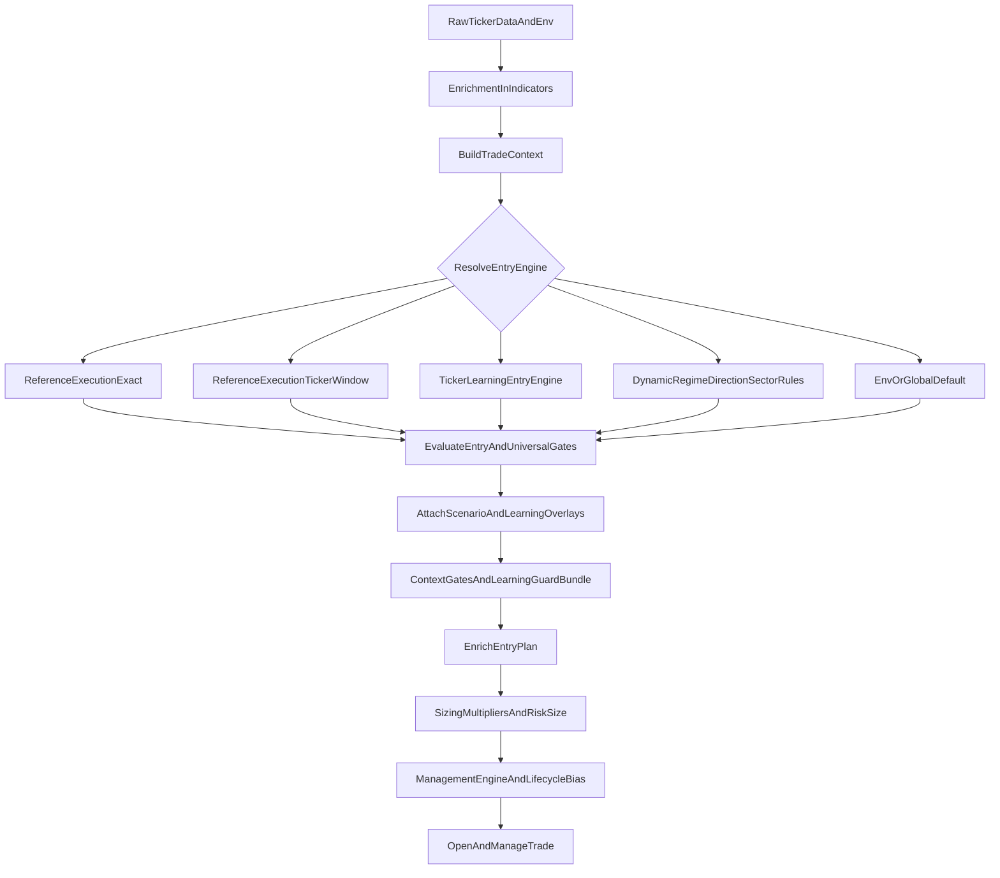

# Runtime Decision Flow

Date: 2026-04-12

## Purpose

Show the actual order in which the live engine adjusts behavior per scenario.

This is not a proposed architecture.

It is a practical map of what happens now in code, and which runtime surfaces can change:

- entry engine
- management engine
- guard behavior
- scalar thresholds
- sizing
- lifecycle bias

## High-Level Rule

The engine does not have one single "adaptive brain."

It adapts in layers:

1. enrich the ticker with regime/profile/context
2. resolve the entry engine
3. qualify the entry through universal and context gates
4. attach ticker/scenario overlays
5. size and manage the trade using the resolved overlays

## Runtime Flow

## What Each Stage Does

### 1. Enrichment creates the adaptive inputs

Main code surfaces:

- `worker/indicators.js`
- `worker/pipeline/trade-context.js`

This stage computes the context that later decisions depend on:

- `regime_class`
- `regime_params`
- `execution_profile`
- `market_internals`
- `overnight_gap`
- `orb`
- `entry_quality`
- `swing_consensus`
- ticker profile / learned behavior context

This is where scalar adaptation is first materialized. In practice, the execution profile can tighten or loosen:

- `minHTFScore`
- `minRR`
- `maxCompletion`
- `positionSizeMultiplier`
- `slCushionMultiplier`
- `requireSqueezeRelease`
- `defendWinnerBias`

## 2. Engine resolution decides which playbook gets first control

Main code surface:

- `resolveEntryEngine()` in `worker/index.js`

Actual precedence:

1. exact `reference_execution_map`
2. ticker/date-window reference execution
3. ticker learning policy entry-engine override
4. dynamic regime / direction / sector rules
5. env/global default

Interpretation:

- reference execution is for parity and narrow historical playbooks
- ticker learning can override engine selection for one symbol
- dynamic rules are the broad regime/sector router
- defaults are the fallback when no stronger surface matches

## 3. Universal qualification runs before scenario overlays can save a bad entry

Main code surface:

- entry qualification path in `worker/index.js`

After engine selection, the system:

- precomputes pullback confirmation
- builds `TradeContext`
- runs universal gates
- dispatches into the selected engine

This matters because a scenario or ticker overlay usually does not resurrect an entry that already failed the universal pipeline.

## 4. Scenario and ticker overlays attach after the entry path is known

Main code surfaces:

- `_resolveScenarioExecutionPolicy()` in `worker/index.js`
- `_resolveTickerLearningPolicy()` in `worker/index.js`
- `_applyTickerLearningPolicyGuard()` in `worker/index.js`

Why this happens after dispatch:

- scenario resolution depends on `entry_path`
- the engine often needs to qualify the pattern first before overlays can refine it

The scenario tuple can match on:

- `ticker`
- `direction`
- `entry_path`
- `regime`
- `vix_bucket`
- `rvol_bucket`
- `market_state`

Current recommendation payloads are best suited to:

- `entry_engine`
- `management_engine`
- `guard_bundle`
- `exit_style`

Ticker learning policy is narrower and more opinionated. It is the better fit for early ticker-specific experimentation than broad regime routing.

## 5. Context gates and guard bundles can still block or degrade a qualified entry

Main code surfaces:

- `_applyContextGates()` in `worker/index.js`
- `_applyTickerLearningPolicyGuard()` in `worker/index.js`

This is where the engine can still say:

- block the trade
- reduce confidence/boost
- require reclaim/reversal/orb confirmation

In other words, engine selection and entry qualification do not automatically guarantee entry execution.

## 6. Management engine overlays matter after qualification

Main code surface:

- post-dispatch overlay block in `worker/index.js`

Both ticker learning policy and scenario policy can override `selectedManagementEngine` after the entry already qualifies.

That means the system can:

- use one engine to qualify the setup
- use another engine to manage the open trade

This is one of the cleanest places where scenario-aware adaptation changes lifecycle behavior without rewriting entry logic.

## 7. Sizing is adaptive and aggregates multiple layers

Main code surface:

- `worker/pipeline/sizing.js`

Sizing combines multiple multipliers:

- `regime_params.positionSizeMultiplier`
- deep-audit regime size multipliers
- RVOL, danger, mean-revert, PDZ, SPY, ORB multipliers
- market internals risk-off discount

Interpretation:

- even when entry and exit logic look unchanged, dollar PnL can drift because capital allocation changed underneath the same move

That is the exact kind of pattern seen in the September `RIOT` drift inside the AGQ challenger.

## 8. Exit style and lifecycle bias are adaptive too

Main code surfaces:

- `_scenarioExitStyleTpFullOnly()` in `worker/index.js`
- `regime_params.defendWinnerBias`

These surfaces influence how aggressively the trade defends profit and whether the runner behaves more like:

- full TP bias
- smart-exit bias
- quick defend
- trim then reassess

This is the main lifecycle layer for "hold longer vs protect sooner" behavior.

## Real-World Interpretation Of The Current Engine

The system is already scenario-aware, but most of the live adaptation currently appears to come from:

- `execution_profile`
- `regime_params`
- profile/ticker characterization
- dynamic engine resolution
- sizing overlays

Much less of the current live behavior appears to be coming from frequent populated `scenario_execution_policy` hits.

In the recent `RIOT` and `AGQ` challenger autopsies:

- `scenario_policy` was usually `null`
- `learning_policy` was usually `null`
- `execution_profile`, `regime_overlay`, and sizing effects were active

So the current engine is dynamic, but mostly through context enrichment plus scalar/profile overlays rather than a dense explicit scenario-policy matrix.

## Recommended Mental Model

Use this mental model when debugging or designing a candidate:

### If the question is:

- "Which entry playbook should run here?"

Think:

- reference execution
- ticker learning policy
- dynamic engine rules

### If the question is:

- "Should this context be tighter, looser, or smaller?"

Think:

- `execution_profile`
- `regime_params`
- sizing multipliers

### If the question is:

- "Should this specific scenario manage the trade differently after entry?"

Think:

- `scenario_execution_policy`
- ticker learning `management_engine`
- `exit_style`
- `defendWinnerBias`

### If the question is:

- "Should one ticker have a narrow exception?"

Think:

- ticker learning runtime policy first
- reference execution only for exact windows
- core engine seam only when the approved runtime carriers are too coarse

## Operator Checklist

When a replay shows behavior drift, classify it in this order:

1. Did enrichment change the context or `regime_params`?
2. Did engine resolution change the selected entry engine?
3. Did scenario/ticker overlays change management engine or guard bundle?
4. Did sizing change while trade identity stayed the same?
5. Did lifecycle bias change exit timing without changing entry?

That order usually separates:

- true semantic regressions
- acceptable scenario-aware adaptation
- pure capital-path drift

## Bottom Line

The live system dynamically adjusts per scenario through a stacked resolution process, not a single policy table.

Today, the strongest adaptive levers are:

- enrichment into `execution_profile` and `regime_params`
- engine resolution precedence
- management-engine overlays
- sizing aggregation
- lifecycle bias

The explicit `scenario_execution_policy` surface is real and important, but it is currently more of a targeted overlay seam than the dominant source of adaptation across the whole lane.
