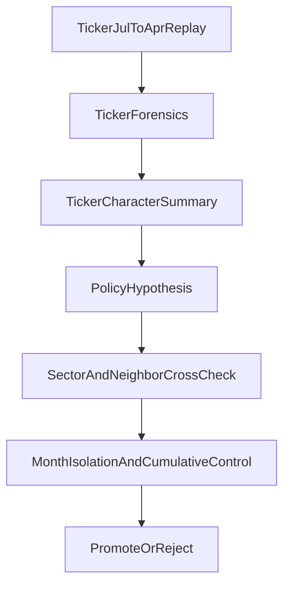

# Ticker-Focused Learning Loop

Date: 2026-04-11

## Purpose

Define how one-ticker `Jul -> Apr` replays should be used as an evidence-generation tool without letting them become an overfit factory.

The key rule is simple:

- one-ticker lanes are for characterization and hypothesis generation
- cumulative month lanes remain the promotion control path

## Why This Exists

Ticker-focused history can teach us valuable things:

- how the ticker reacts to trend emergence versus mature trend
- how it behaves around the `200 EMA`
- whether it respects reclaim confirmation
- whether it needs faster or slower profit defense
- whether its runner behavior is closer to `RIOT`, `GRNY`, `AGQ`, or something else entirely

But if used incorrectly, one-ticker lanes can also teach the wrong lesson by overfitting to a small sample.

## Inputs

Use:

- `scripts/replay-focused.sh`
- `scripts/build-ticker-learning.js`
- `scripts/build-ticker-profiles.js`
- `scripts/trade-intelligence.js`
- `scripts/build-regime-evidence-matrix.js`
- archived run artifacts
- `ticker_profiles.learning_json`

## Loop

## Required Outputs

Each one-ticker lane should produce:

- artifact bundle
- ticker-specific trade list
- setup-family breakdown
- move-lifecycle summary
- regime / VIX / month distribution
- top-winner and top-loser review
- ticker character summary
- candidate policy hypotheses

## Ticker Character Summary

Summarize the ticker using a standard template:

- trend emergence behavior
- mature continuation behavior
- pullback quality profile
- reclaim reliability
- stop-out style
- runner giveback style
- 200 EMA / key-structure behavior
- earnings or macro sensitivity
- preferred management style

The output should describe the ticker, not prescribe broad policy yet.

## Allowed Outcomes

### 1. No policy change

If the lane reveals noise or insufficient sample, keep the evidence only.

### 2. Profile-level hypothesis

If the behavior looks shared with similar names, convert it into a profile hypothesis rather than a ticker rule.

### 3. Regime-level hypothesis

If the ticker only behaves differently in a specific backdrop, convert it into a regime hypothesis.

### 4. Ticker-specific hypothesis

Only when the ticker remains a durable outlier after the broader explanations are checked.

## Anti-Overfit Guardrails

- Never promote a ticker rule from a single compelling trade.
- Never promote a ticker rule without checking at least two distinct time windows or month clusters.
- Never use one-ticker results alone to widen into production logic.
- Always compare the ticker-specific hypothesis against:
  - the sector
  - similar setup families
  - the cumulative month savepoint

## Promotion Handoff

A ticker-focused hypothesis may advance only when:

- the evidence matrix labels it candidate-worthy
- the hypothesis is routed to the right policy layer
- it passes isolated month validation
- it survives the cumulative rerun

## Recommended First Use

Use the first ticker-focused cycle to characterize the known move-lifecycle names that already exposed management variation:

- `RIOT`
- `GRNY`
- `AGQ`

Primary question:

- what variable-aware policy differences are truly about the ticker itself versus the move lifecycle, setup family, and broader market backdrop

## Working Rule

If a one-ticker lane teaches something useful, the next step is not “promote it.”

The next step is:

1. classify the hypothesis
2. test it on the right month
3. rerun the cumulative window
4. only then decide whether it deserves runtime selection
